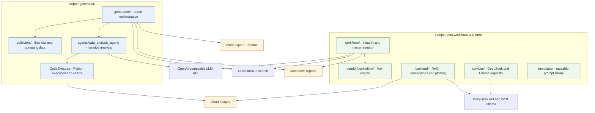

# Agent-powered Financial Multimodal Report Generator

AI-assisted financial research that combines public data collection, iterative Python analysis, chart generation, and report writing.

[中文说明](README.zh-CN.md) · [Repository guide](docs/REPOSITORY_STRUCTURE.md) · [MIT license](LICENSE)

## What is included

| Component | Responsibility |
| --- | --- |
| `financial_reports/generators/` | Basic analysis, integrated company research, and in-depth report generation |
| `financial_reports/agents/data_analysis_agent/` | LLM-assisted analysis, code execution, session outputs, and charts |
| `financial_reports/collectors/` | Financial statements, company profiles, shareholder data, and peer identification |
| `financial_reports/workflows/` | Standalone industry and macroeconomic research flows using the bundled PocketFlow engine |
| `financial_reports/backend/` | DeepSeek/Ollama requests, vector retrieval, and plotting utilities |
| `financial_reports/templates/` | Analysis prompts, report structure prompts, and content prompts |
| `scripts/`, `notebooks/`, `examples/` | Crawling scripts, an exploratory notebook, and a backend import example |
| `data/samples/`, `docs/references/` | Historical search results and the original report reference document |

## Architecture

The arrows show responsibilities and direct dependencies in the current code. The industry/macro workflows and backend toolkit are independent entry points. The reusable template library is available separately; it is not automatically wired into every generator.



## Repository structure

The tree shows committed files and directories; package `__init__.py` markers and module internals are omitted for readability.

```text
Agent-powered-Financial-Multimodal-Report-Generator/
├── financial_reports/
│   ├── agents/data_analysis_agent/
│   ├── backend/
│   │   ├── config/
│   │   ├── templates/
│   │   ├── utils/
│   │   └── main.py
│   ├── collectors/
│   ├── config/deepseek.py
│   ├── generators/
│   │   ├── research_report_generator.py
│   │   ├── integrated_research_report_generator.py
│   │   └── in_depth_research_report_generator.py
│   ├── services/llm.py
│   ├── templates/
│   │   ├── analysis/prompts.py
│   │   ├── content/
│   │   └── structure/
│   ├── vendor/pocketflow/
│   └── workflows/
│       ├── industry_workflow.py
│       └── macro_workflow.py
├── scripts/crawlers/scrape.py
├── notebooks/Scrape.ipynb
├── examples/backend_imports.py
├── data/samples/industry/all_search_results.json
├── docs/
│   ├── history/
│   ├── references/公司研报 需要.docx
│   ├── REPOSITORY_STRUCTURE.md
│   └── reorganization-manifest.json
├── tests/test_repository_layout.py
├── .env.example
├── .gitattributes
├── .gitignore
├── requirements.txt
├── LICENSE
├── README.md
└── README.zh-CN.md
```

All application Python modules live under `financial_reports/`. Notebook experiments, crawling scripts, sample data, and documentation have their own directories. Backend-specific prompt copies remain in `backend/templates/`; the general templates live in `templates/`.

## Install and configure

Run commands from the repository root using a Python environment compatible with `requirements.txt`.

```bash
git clone https://github.com/Zicheng-Xie/Agent-powered-Financial-Multimodal-Report-Generator.git
cd Agent-powered-Financial-Multimodal-Report-Generator
python -m pip install -r requirements.txt
```

Copy `.env.example` to `.env` and configure the providers used by your entry point:

```env
OPENAI_API_KEY=your_api_key
OPENAI_BASE_URL=https://api.openai.com/v1
OPENAI_MODEL=your_model_name

DEEPSEEK_API_KEY=your_deepseek_api_key
DEEPSEEK_BASE_URL=https://api.deepseek.com
```

The report generators and research workflows use the OpenAI-compatible settings. The backend and `services/llm.py` use the DeepSeek key. Backend embeddings require a local Ollama service at `http://localhost:11434` with `bge-m3:latest`; the standalone LLM service also provides a `qwen2:0.5b` request method. Word export requires a separately installed Pandoc executable on `PATH`.

## Run

### Integrated company report

```bash
python -m financial_reports.generators.integrated_research_report_generator
```

The existing script defaults to SenseTime (`00020`, `HK`). To select another company, use its existing constructor:

```python
from financial_reports.generators.integrated_research_report_generator import IntegratedResearchReportGenerator

generator = IntegratedResearchReportGenerator(
    target_company="SenseTime",
    target_company_code="00020",
    target_company_market="HK",
)
basic_report, deep_report = generator.run_full_pipeline()
```

### Other entry points

| Purpose | Command |
| --- | --- |
| Original basic research script | `python -m financial_reports.generators.research_report_generator` |
| In-depth report from an existing Markdown file | `python -m financial_reports.generators.in_depth_research_report_generator` |
| Industry research example | `python -m financial_reports.workflows.industry_workflow` |
| Macro research example | `python -m financial_reports.workflows.macro_workflow` |
| Annual-report crawler | `python -m scripts.crawlers.scrape` |
| Backend import example | `python -m examples.backend_imports` |

Set company parameters and research topics in the corresponding script before running. The in-depth script currently specifies its input Markdown filename in `main()`. The crawler exposes year, market, and industry settings in its script entry point. The basic script performs external work at module load, so use the integrated class for programmatic integration. The backend example loads utility classes; it does not start a web server.

### Analyze supplied data

```python
from financial_reports.agents.data_analysis_agent import quick_analysis, LLMConfig

result = quick_analysis(
    query="Analyze revenue trends and generate charts.",
    files=["path/to/financial_data.csv"],
    llm_config=LLMConfig(),
)
```

See the [agent guide](financial_reports/agents/data_analysis_agent/README.md) for its analysis interface. Open `notebooks/Scrape.ipynb` in your notebook environment; it contains exploratory crawling and data-processing code.

## Data and generated outputs

`data/samples/industry/all_search_results.json` is a historical sample, not a current market data feed. Existing workflows create `download_financial_statement_files/`, `company_info/`, `industry_info/`, `outputs/`, and report/image files relative to the working directory. These runtime directories are not bundled datasets; they are kept out of Git where applicable. Generated reports may also be written at the repository root by the original scripts.

## Validation and migration

```bash
python -m unittest discover -s tests -v
```

The offline checks cover Python syntax, internal module resolution, pure template imports, and the bundled workflow engine. They do not execute live LLM requests, financial data collection, or full report generation.

The [repository guide](docs/REPOSITORY_STRUCTURE.md) records the new layout and entry points. The [migration inventory](docs/reorganization-manifest.json) maps every original file to its current path. The earlier [local integration record](docs/history/LOCAL_INTEGRATION.md) remains as a historical snapshot, whose paths refer to the layout before this reorganization.

## License and use

The existing [MIT license](LICENSE) and source attribution are retained. Generated financial reports are reference material and require review against original disclosures before use.
