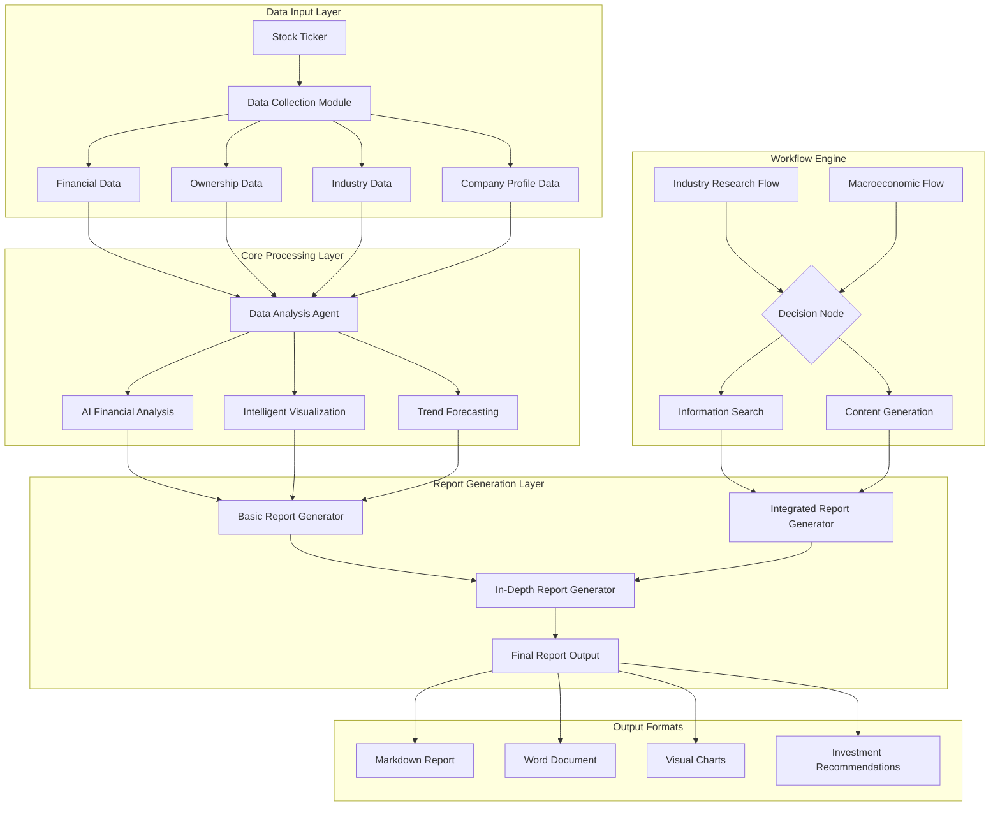

# Automated Financial Research Report Generation System

🤖 **An Intelligent Financial Research Report Generation Platform Powered by Large Language Models**

[](https://python.org)
[](LICENSE)
[](https://openai.com)

## 📋 Project Overview

This project is an automated financial research report generation system powered by large language models (LLMs), designed for financial analysts, investors, and research institutions. By integrating multi-source data collection, intelligent data analysis, and professional report generation, it automates the entire workflow from data acquisition to research report output.

### 🎯 Key Features

- **📊 Multi-Dimensional Data Collection**: Automatically retrieves financial statements, ownership structure, industry information, and other multi-source data
- **🤖 Intelligent Financial Analysis**: AI-driven financial analysis, peer comparison, and trend forecasting
- **📈 Automated Visualization**: Generates professional financial charts and data visualizations
- **📝 In-Depth Report Generation**: Produces complete research reports with investment recommendations
- **🔄 Workflow Engine**: Supports automated workflows for industry analysis and macroeconomic research

## 🏗️ System Architecture

### Architecture Diagram

> Important:
> - Make sure the Mermaid block is fully closed with a standalone triple-backtick line.
> - Do NOT append headings (e.g., `##`) on the same line as `end` or the closing fence.



### Project Directory Structure

```text
financial_research_report/
├── 📄 Core Generators
│   ├── research_report_generator.py             # Basic report generator
│   ├── integrated_research_report_generator.py  # Integrated report generator
│   └── in_depth_research_report_generator.py    # In-depth report generator
├── 📄 Workflow Engine
│   ├── industry_workflow.py                     # Industry research workflow
│   └── macro_workflow.py                        # Macroeconomic research workflow
├── 📁 Data Analysis Agent
│   └── data_analysis_agent/                     # AI data analysis module
│       ├── __init__.py
│       ├── data_analysis_agent.py               # Main analysis engine
│       ├── prompts.py                           # Prompt templates
│       ├── README.md                            # Module documentation
│       ├── config/                              # Configuration files
│       │   ├── __init__.py
│       │   └── llm_config.py                    # LLM configuration
│       └── utils/                               # Utility functions
│           ├── __init__.py
│           ├── code_executor.py                 # Code executor
│           ├── create_session_dir.py            # Session directory creation
│           ├── extract_code.py                  # Code extraction
│           ├── fallback_openai_client.py        # Fallback OpenAI client
│           ├── format_execution_result.py       # Result formatting
│           └── llm_helper.py                    # LLM helper
├── 📁 Data Collection Tools
│   └── utils/                                   # Data retrieval toolkit
│       ├── get_base_info.py                     # Base info retrieval
│       ├── get_company_info.py                  # Company info retrieval
│       ├── get_financial_statements.py          # Financial statements retrieval
│       ├── get_shareholder_info.py              # Shareholder info retrieval
│       ├── get_stock_intro.py                   # Stock introduction retrieval
│       ├── identify_competitors.py              # Competitor identification
│       └── search_info.py                       # Information search
├── 📁 Workflow Framework
│   └── pocketflow/                              # Lightweight workflow engine
│       └── __init__.py
├── 📁 Data Storage
│   ├── company_info/                            # Company base information
│   │   ├── Baidu_HK_09888_info.txt
│   │   ├── Cambricon_A_SH688256_info.txt
│   │   ├── iFlytek_A_SZ002230_info.txt
│   │   ├── SenseTime_HK_00020_info.txt
│   │   └── CloudWalk_A_SH688327_info.txt
│   ├── download_financial_statement_files/      # Financial statement data
│   │   ├── [Company]_balance_sheet_annual.csv        # Balance sheet
│   │   ├── [Company]_cash_flow_statement_annual.csv  # Cash flow statement
│   │   └── [Company]_income_statement_annual.csv     # Income statement
│   └── industry_info/                           # Industry information
│       └── all_search_results.json              # Aggregated search results
├── 📁 Output Results
│   └── outputs/                                 # Generated reports and charts
│       └── session_[ID]/                        # Session-based outputs
│           ├── Operating_Cash_Flow_Trend.png
│           ├── Net_Profit_Trend.png
│           ├── Revenue_Trend.png
│           └── Assets_and_Equity_Trend.png
├── 📄 Configuration Files
│   ├── requirements.txt                         # Python dependencies
│   └── LICENSE                                  # Open-source license
└── 📄 Documentation
    └── README.md                                # Project documentation
```

## 🚀 Core Capabilities

### 1. Multi-Source Data Integration

- **Financial Data**: Retrieves the three core financial statements (balance sheet, income statement, cash flow statement) via AkShare
- **Ownership Structure**: Automatically crawls shareholder information from platforms such as iFinD / Tonghuashun
- **Industry Information**: Collects industry news and market information using DuckDuckGo search
- **Company Profile**: Fetches fundamental company information and business descriptions

### 2. Intelligent Analysis Engine

- **Financial Analysis**: Revenue growth, profitability, solvency, and operating efficiency analysis
- **Peer Benchmarking**: Automatically identifies competitors and performs horizontal comparisons
- **Trend Forecasting**: Future performance forecasting and valuation modeling based on historical data
- **Risk Assessment**: Comprehensive assessment of financial, industry, and market risks

### 3. Professional Report Generation

- **Structured Output**: Standardized research report formats and section templates
- **Chart Visualization**: Professional financial charts and visualizations
- **Investment Recommendations**: Clear investment ratings and recommendations based on analytical results
- **Multiple Output Formats**: Supports Markdown, Word, and other formats

## 🛠️ Installation and Configuration

### Requirements

- Python 3.8+
- OpenAI API key (or any OpenAI-compatible LLM service)

### Install

```bash
pip install -r requirements.txt
```

### Configure Environment Variables

```bash
# Linux / macOS
export OPENAI_API_KEY="YOUR_API_KEY"

# Windows (PowerShell)
setx OPENAI_API_KEY "YOUR_API_KEY"
```

### Run (Example)

```bash
python research_report_generator.py --ticker 000001
```

> If your scripts use a different CLI entrypoint, adjust the command accordingly.

## 📄 License

This project is licensed under the MIT License. See the [LICENSE](LICENSE) file for details.

## Local project integration

The missing `data_analysis_agent/`, `utils/`, `pocketflow/`, and `Backend/` modules have been restored from the local project. This repository also includes the original crawler (`data/scrape` and `Scrape.ipynb`), additional report content templates, and the Word reference document.

- [Chinese project documentation](README.zh-CN.md)
- [Integration inventory and validation](docs/LOCAL_INTEGRATION.md)

Copy `.env.example` to `.env`, then fill in `OPENAI_API_KEY` for the research report generators and `DEEPSEEK_API_KEY` for the backend and `llm.py`. `llm.py` also uses a local Ollama service; the backend embeddings use Ollama at `http://localhost:11434` with `bge-m3:latest`.

Install the complete dependencies with `pip install -r requirements.txt`. Run commands from the repository root; the original backend entry point can be loaded as `python -m Backend.main` after configuring the API key.

Generated data and output directories shown in the architecture overview are created by the workflows and are not bundled as complete datasets. File integration and static validation do not establish that live API calls or report generation succeed.
