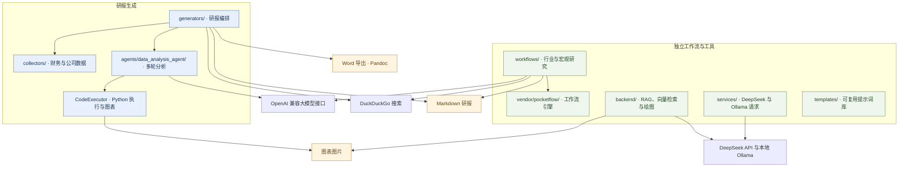

# 智能体赋能的金融研报生成系统

整合公开数据采集、大模型分析、Python 图表生成和研报撰写的金融多模态报告工程。

[English](README.md) · [目录与迁移说明](docs/REPOSITORY_STRUCTURE.md) · [MIT 许可证](LICENSE)

## 功能与模块

| 模块 | 职责 |
| --- | --- |
| `financial_reports/generators/` | 基础分析、整合式公司研报和深度研报生成 |
| `financial_reports/agents/data_analysis_agent/` | 多轮数据分析、代码执行、会话输出与图表 |
| `financial_reports/collectors/` | 财务报表、公司资料、股东信息和竞争对手识别 |
| `financial_reports/workflows/` | 基于内置 PocketFlow 的独立行业与宏观研究工作流 |
| `financial_reports/backend/` | DeepSeek/Ollama 调用、向量检索和绘图工具 |
| `financial_reports/templates/` | 分析提示词、研报结构模板和章节内容模板 |
| `scripts/`、`notebooks/`、`examples/` | 爬虫脚本、探索性 Notebook 和后端工具加载示例 |
| `data/samples/`、`docs/references/` | 历史搜索样本和原始研报参考文档 |

## 系统架构

连线表示当前代码的职责与直接依赖。行业/宏观工作流和后端工具有各自的入口；提示词库单独保留供复用，并未自动接入每个研报生成器。



## 工程目录

下列目录树反映已提交的文件；为便于阅读，省略各包的 `__init__.py` 和部分模块内部文件。

```text
Agent-powered-Financial-Multimodal-Report-Generator/
├── financial_reports/
│   ├── agents/data_analysis_agent/
│   ├── backend/
│   │   ├── config/
│   │   ├── templates/
│   │   ├── utils/
│   │   └── main.py
│   ├── collectors/
│   ├── config/deepseek.py
│   ├── generators/
│   │   ├── research_report_generator.py
│   │   ├── integrated_research_report_generator.py
│   │   └── in_depth_research_report_generator.py
│   ├── services/llm.py
│   ├── templates/
│   │   ├── analysis/prompts.py
│   │   ├── content/
│   │   └── structure/
│   ├── vendor/pocketflow/
│   └── workflows/
│       ├── industry_workflow.py
│       └── macro_workflow.py
├── scripts/crawlers/scrape.py
├── notebooks/Scrape.ipynb
├── examples/backend_imports.py
├── data/samples/industry/all_search_results.json
├── docs/
│   ├── history/
│   ├── references/公司研报 需要.docx
│   ├── REPOSITORY_STRUCTURE.md
│   └── reorganization-manifest.json
├── tests/test_repository_layout.py
├── .env.example
├── .gitattributes
├── .gitignore
├── requirements.txt
├── LICENSE
├── README.md
└── README.zh-CN.md
```

业务源码统一归入 `financial_reports/`。爬虫、Notebook、样例数据和文档分别归类；后端专用提示词保留在 `backend/templates/`，通用模板放在 `templates/`。

## 安装与配置

在仓库根目录执行命令，使用与 `requirements.txt` 兼容的 Python 环境。

```bash
git clone https://github.com/Zicheng-Xie/Agent-powered-Financial-Multimodal-Report-Generator.git
cd Agent-powered-Financial-Multimodal-Report-Generator
python -m pip install -r requirements.txt
```

将 `.env.example` 复制为 `.env`，填写实际入口所需的配置：

```env
OPENAI_API_KEY=your_api_key
OPENAI_BASE_URL=https://api.openai.com/v1
OPENAI_MODEL=your_model_name

DEEPSEEK_API_KEY=your_deepseek_api_key
DEEPSEEK_BASE_URL=https://api.deepseek.com
```

研报生成器和研究工作流使用 OpenAI 兼容配置；后端工具及 `services/llm.py` 使用 DeepSeek 密钥。后端向量嵌入需要在 `http://localhost:11434` 运行 Ollama 并准备 `bge-m3:latest`；独立 LLM 封装还提供 `qwen2:0.5b` 请求方法。Word 导出需要另行安装 Pandoc，并将其加入 `PATH`。

## 使用入口

### 整合式公司研报

```bash
python -m financial_reports.generators.integrated_research_report_generator
```

现有脚本默认分析商汤科技（`00020`、`HK`）。分析其他公司时，可使用代码中已有的构造参数：

```python
from financial_reports.generators.integrated_research_report_generator import IntegratedResearchReportGenerator

generator = IntegratedResearchReportGenerator(
    target_company="商汤科技",
    target_company_code="00020",
    target_company_market="HK",
)
basic_report, deep_report = generator.run_full_pipeline()
```

### 其他脚本

| 用途 | 命令 |
| --- | --- |
| 原始基础研报脚本 | `python -m financial_reports.generators.research_report_generator` |
| 从既有 Markdown 生成深度研报 | `python -m financial_reports.generators.in_depth_research_report_generator` |
| 行业研究示例 | `python -m financial_reports.workflows.industry_workflow` |
| 宏观研究示例 | `python -m financial_reports.workflows.macro_workflow` |
| 年报爬虫 | `python -m scripts.crawlers.scrape` |
| 后端工具加载示例 | `python -m examples.backend_imports` |

运行前在对应脚本中设置研究公司、主题等参数。深度研报脚本的输入 Markdown 文件名目前写在 `main()` 中；爬虫的年份、市场和行业配置在脚本入口中。基础研报脚本在模块加载时会执行外部操作，程序化调用建议使用整合式生成器类。后端示例仅加载工具类，不会启动 Web 服务。

### 对自有数据进行分析

```python
from financial_reports.agents.data_analysis_agent import quick_analysis, LLMConfig

result = quick_analysis(
    query="分析营业收入趋势，并生成图表。",
    files=["path/to/financial_data.csv"],
    llm_config=LLMConfig(),
)
```

详细接口见[数据分析智能体说明](financial_reports/agents/data_analysis_agent/README.md)。`notebooks/Scrape.ipynb` 保留了探索性的爬虫与数据处理代码，可在 Notebook 环境中打开。

## 样例与运行产物

`data/samples/industry/all_search_results.json` 是历史搜索样本，不能视为实时市场数据。现有脚本会相对于工作目录创建 `download_financial_statement_files/`、`company_info/`、`industry_info/`、`outputs/` 等目录，以及研报和图表文件。这些运行目录不是随仓库附带的完整数据集；原脚本也可能在仓库根目录保存生成的报告。

## 验证与迁移

```bash
python -m unittest discover -s tests -v
```

离线检查覆盖 Python 语法、内部模块引用、纯提示词模块导入和内置工作流引擎；不执行真实大模型请求、财务数据采集或完整研报生成。

[目录说明](docs/REPOSITORY_STRUCTURE.md)记录各文件夹职责和新入口；[迁移清单](docs/reorganization-manifest.json)记录全部原文件的新路径。上次的[本地补全记录](docs/history/LOCAL_INTEGRATION.md)作为历史快照保留，其中的路径对应整理前的目录。

## 许可证与使用说明

保留既有 [MIT 许可证](LICENSE)及源码署名。生成的金融研报仅供参考，使用前应结合原始披露资料核对。
